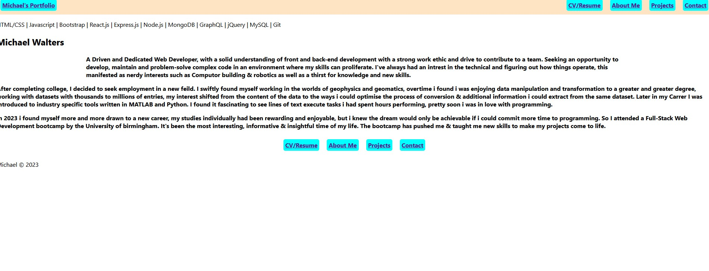

# React Portfolio 

##  Description 

Live link: https://michaelw1996.github.io/mw-react-portfolio/

A new portfolio built using react to show off my projects and work

## Screenshot

## Contents

-[Description](#Description)  
 -[Install](#Install)  
 -[Usage Info](#Usage)  
 -[Contribution](#Contribution)  
 -[Questions](#Questions)  
 -[Tests](#Tests)  
 -[License](#License)

##  Install 

npm i to download packages then npm run start to launch locally, otherwise, just use the deployed site

##  Usage 

use nav buttons for navigation, projects link to deployed page or repo

##  Contribution 

Created by Michael Walters  
 See github to contribute or report bugs: https://github.com/MichaelW1996

##  Questions 

For issues or feature requests: https://github.com/MichaelW1996  
 For other questions, please email me: michael1996walters@gmail.com

##  Tests 

no formal tests

##  License 

MIT  
 https://opensource.org/licenses/MIT  
 Copyright Michael Walters
Permission is hereby granted, free of charge, to any person obtaining a copy of this software and associated documentation files (the "Software"), to deal in the Software without restriction, including without limitation the rights to use, copy, modify, merge, publish, distribute, sublicense, and/or sell copies of the Software, and to permit persons to whom the Software is furnished to do so, subject to the following conditions:

      The above copyright notice and this permission notice shall be included in all copies or substantial portions of the Software.

      THE SOFTWARE IS PROVIDED "AS IS", WITHOUT WARRANTY OF ANY KIND, EXPRESS OR IMPLIED, INCLUDING BUT NOT LIMITED TO THE WARRANTIES OF MERCHANTABILITY, FITNESS FOR A PARTICULAR PURPOSE AND NONINFRINGEMENT. IN NO EVENT SHALL THE AUTHORS OR COPYRIGHT HOLDERS BE LIABLE FOR ANY CLAIM, DAMAGES OR OTHER LIABILITY, WHETHER IN AN ACTION OF CONTRACT, TORT OR OTHERWISE, ARISING FROM, OUT OF OR IN CONNECTION WITH THE SOFTWARE OR THE USE OR OTHER DEALINGS IN THE SOFTWARE.
